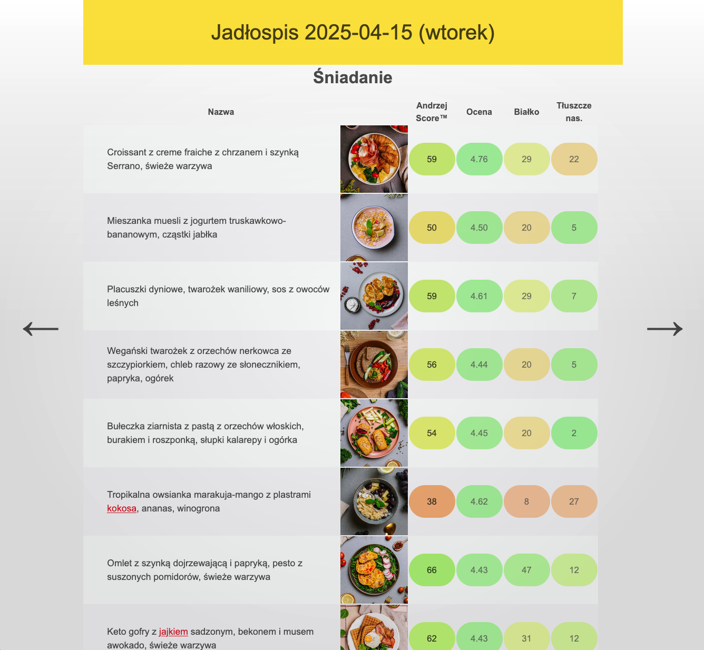

# NTFY Viewer

The purpose of this project is to facilitate the selection of meals for NTFY catering subscribers,
based on the contents of protein and saturated fats, as well as the general user rating.

## Running it

0. (If you don't have it, install `yarn`)
```npm install -g yarn```
1. Install dependencies
```yarn install```
2. Go to [app.ntfy.pl](https://app.ntfy.pl/) and log in
3. Open the browser dev tools, refresh the page and find an XHR GET request. Copy the value of
   the `authorization` header (skip the `Bearer ` part) into the `.env` file as the value of
   the `PUBLIC_AUTH_TOKEN` variable (as in `.env.example`)
4. Run the application and enjoy
```yarn dev --open```
5. Tokens are good for 14 days - you'll have to log in and refresh it every now and then.

## Features

### AndrzejScore™

The aim of the score is to provide a single numerical value derived from the meal rating
and its nutritional value. Ideally, meal selection can be based solely on this value.
The score is a number roughly between 0 and 100, with higher values indicating a better meal.
Inspect `src/lib/score.ts`'s `calculateScore` to learn how exactly it's calculated.

### Green list and red list

In order to automatically color certain keywords (of the description) green and red, modify your
`.env` file according to [the example](.env.example) and fill the `PUBLIC_GREENLIST` and
`PUBLIC_REDLIST` variables with foods you like/dislike, divided by the `|` sign.

(Tip: It's actually a regex and more complex expressions are allowed.

### What it looks like



## To do
- [ ] (sticky) anchor links to each meal header
- [ ] use some advanced table component that allows for showing & hiding columns (carbs etc)
- [ ] filters by percentile protein, rating, etc.
- [ ] general score mode (based on nutrition facts)
